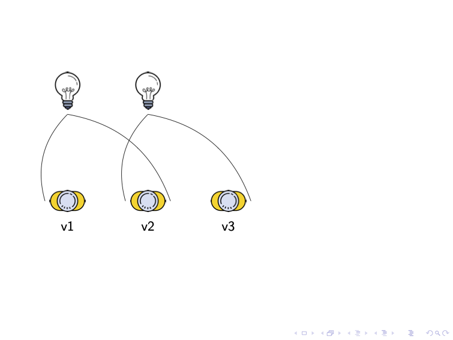
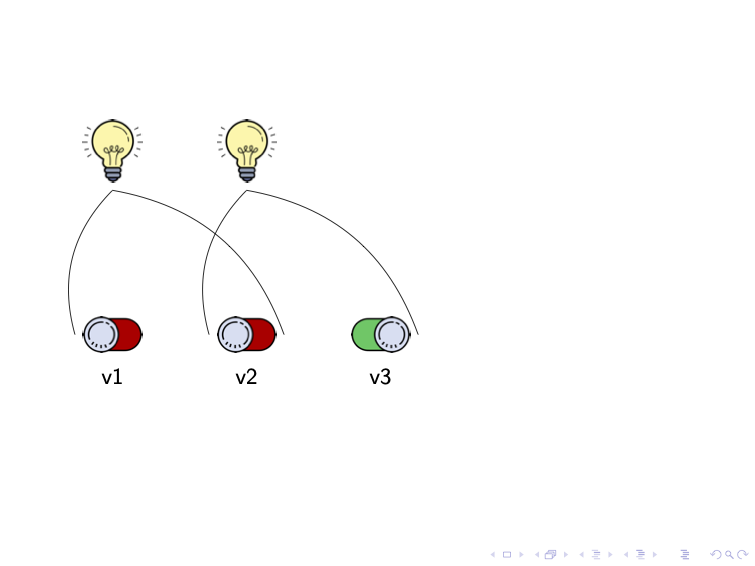
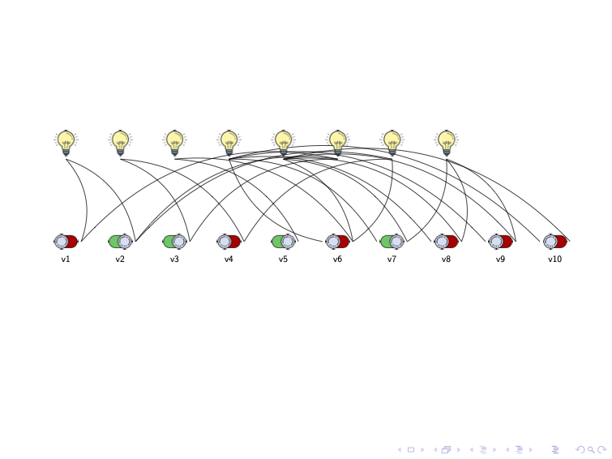

# CNF to light and switch generator

[](https://travis-ci.org/danielleberre/cnf2lightswitch)
[](https://sonarcloud.io/dashboard?id=dlb%3Acnf2lightandswitch)

Small utility script to translate small Dimacs formatted CNF files into
light and switch picture in tikz.

Input `sat.cnf`

```
p cnf 3 2
-1 2 0
-2 3 0
```

The command `./cnf2lightswitch.py sat.cnf </dev/null` generates the tex file to produce the picture



Using your preferred SAT solver, it is possible to also display a satisfying assignment.

The command `solver sat.cnf | ./cnf2lightswitch.py sat.cnf` generates the tex file to produce the picture



Using [Sat4j](www.sat4j.org), it is possible to generate all satisfying assignment.

`java -Dall -Dprintallmodels -jar lib/org.sat4j.core.jar sat.cnf | ./cnf2lightswitch.py sat.cnf`

The script allows to display problems with up to 10 variables and clauses.



This script follows the description of the SAT problem as a light and switch problem
in [this interview](https://www.lemonde.fr/blog/binaire/2019/10/04/ils-ne-savaient-pas-que-cetait-insoluble-alors-ils-lont-resolu/) and the presentation
made at [PDIA 2019](https://afia.asso.fr/pdia-2019/).

Images and tikz tricks have been provided by [Marie Pelleau](https://github.com/mpelleau/).

